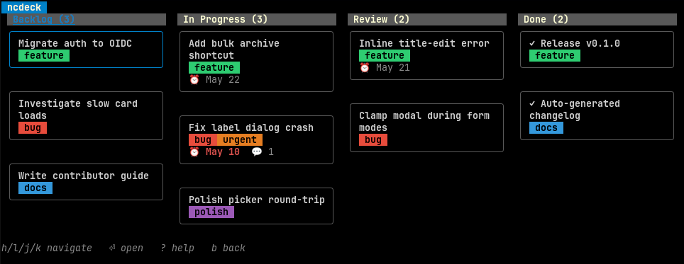

# ncdeck

A CLI and TUI client for [Nextcloud Deck](https://apps.nextcloud.com/apps/deck), written in Go.

<p align="center">
  
</p>

The CLI is designed for scripts and AI agents: every command supports `--json`,
authentication can be set entirely via environment variables, and destructive
operations require `--yes` when stdin is not a TTY. The TUI replicates the
official Deck web layout (board picker, kanban columns, card detail) and is
keyboard-driven.

## Installation

### Binary release

Download a prebuilt archive for your platform from the
[releases page](https://github.com/raspbeguy/ncdeck/releases) and place the
`ncdeck` binary on your `$PATH`.

### From source

```sh
go install github.com/raspbeguy/ncdeck@latest
```

Requires Go 1.22 or newer. The compiled binary is fully static (CGO disabled).

## Authentication

ncdeck talks to Nextcloud over HTTPS using Basic auth with an *app password*
(not your real password). Generate one in Nextcloud under
`Settings -> Security -> Devices & sessions -> Create new app password`, or use
the interactive login flow below.

Two ways to set credentials:

### Interactive (Login Flow v2)

```sh
ncdeck login --url https://cloud.example.com
```

ncdeck prints a URL, attempts to open it in your default browser, then polls
the Nextcloud login endpoint until you approve the device. The generated app
password is written to `~/.config/ncdeck/config.yaml` with mode `0600`.

### Headless (CI, scripts, AI agents)

```sh
ncdeck config set \
    --url https://cloud.example.com \
    --user alice \
    --token <app-password>
```

Or skip the config file entirely with environment variables:

```sh
export NCDECK_URL=https://cloud.example.com
export NCDECK_USER=alice
export NCDECK_TOKEN=<app-password>
ncdeck board ls
```

Flag > env var > config file, in that order.

## CLI

Every command has a human-readable default output and a `--json` flag for
machine consumption. IDs are numeric and can be looked up with the corresponding
`ls` command.

```sh
ncdeck board ls [--archived] [--details]
ncdeck board create <title> [--color HEX]
ncdeck board show <id>
ncdeck board update <id> [--title T] [--color HEX] [--archived]
ncdeck board delete <id> [--yes]
ncdeck board export <id> [-o FILE]
ncdeck board import <FILE> [--title T] [--board-index N] [--skip-assignees] [--keep-default-labels]

ncdeck stack ls <boardID>
ncdeck stack create <boardID> <title> [--order N]
ncdeck stack rename <boardID> <stackID> <title>
ncdeck stack delete <boardID> <stackID> [--yes]

ncdeck card ls <boardID> [--stack ID] [--archived]
ncdeck card create <boardID> <stackID> <title> [--description STR | -F FILE] [--due ISO8601]
ncdeck card show <boardID> <stackID> <cardID>
ncdeck card edit <boardID> <stackID> <cardID> [--title T] [--description STR | -F FILE] [--due ISO8601] [--done]
ncdeck card move <boardID> <stackID> <cardID> --to-stack ID [--order N]
ncdeck card assign|unassign <boardID> <stackID> <cardID> <userID>
ncdeck card label|unlabel <boardID> <stackID> <cardID> <labelID>
ncdeck card archive|unarchive <boardID> <stackID> <cardID>
ncdeck card delete <boardID> <stackID> <cardID> [--yes]

ncdeck label ls <boardID>
ncdeck label create <boardID> <title> --color HEX
ncdeck label delete <boardID> <labelID> [--yes]

ncdeck comment ls <cardID> [--limit N] [--offset N]
ncdeck comment add <cardID> "message"

ncdeck attach ls <boardID> <stackID> <cardID>
ncdeck attach upload <boardID> <stackID> <cardID> <file>
ncdeck attach download <boardID> <stackID> <cardID> <attachmentID> [-o PATH]

ncdeck tui [boardID]
```

### Examples

Pipe-friendly scripts:

```sh
# All board titles
ncdeck board ls --json | jq -r '.[].title'

# Create a board and a Todo stack in one shot
BID=$(ncdeck board create "Sprint 12" --json | jq -r .id)
SID=$(ncdeck stack create $BID Todo --json | jq -r .id)
ncdeck card create $BID $SID "Plan retro" --due 2026-06-01

# Clear a card's due date
ncdeck card edit $BID $SID 42 --due ""
```

Clearing a due date requires passing `--due ""` explicitly (sends JSON `null`).

To clear `done`, omit `--done` (or pass `--done=false`) on the next `card edit`.

### Board import / export

`ncdeck board export` and `ncdeck board import` use the same JSON schema as
Nextcloud's server-side `occ deck:export` / `occ deck:import`, so files
round-trip between either tool.

```sh
ncdeck board export 11 -o demo.json
ncdeck board import demo.json --title "demo (copy)"
```

What does round-trip: titles, colors, descriptions, due dates, done state,
archived flag, label assignments, user assignees (when the UID exists on the
target server). What doesn't: comments (omitted by the schema), attachment
payload bytes, and timestamps (`createdAt` / `lastModified` are server-set).

**Why client-side import?** Deck's web-UI import button POSTs to a
non-API route that needs session cookies + a CSRF token, which ncdeck (basic
auth via app passwords) can't easily supply. Its documented API import
endpoint accepts basic auth but is currently broken (the `data` field
arrives at the PHP controller as an int regardless of payload). And even
when the web-UI path works, the server-side importer drops the `done`
timestamp on cards; `ncdeck board import` restores it. So the trade-off is
~45 requests against a single multipart POST, in exchange for app-password
auth, per-card progress, precise error context, and a faithful `done`
state.

## TUI

Launch with `ncdeck tui` (board picker) or `ncdeck tui <boardID>` to jump
straight to a board. The TUI uses [Bubble Tea](https://github.com/charmbracelet/bubbletea)
and supports mouse selection where the terminal allows it.

### Board picker

| Key             | Action                                  |
| --------------- | --------------------------------------- |
| `j` / `down`    | Next board                              |
| `k` / `up`      | Previous board                          |
| `g` / `G`       | First / last                            |
| `enter`, `l`    | Open board                              |
| `n`             | New board (title prompt)                |
| `e`             | Rename board                            |
| `c`             | Recolour board                          |
| `x`             | Delete board (with confirmation)        |
| `r`             | Refresh                                 |
| `q` / `esc`     | Quit                                    |

### Kanban view

| Key             | Action                                              |
| --------------- | --------------------------------------------------- |
| `h` / `l`       | Previous / next column                              |
| `j` / `k`       | Move cursor within column                           |
| `J` / `K`       | Reorder focused card down / up within column        |
| `enter`         | Open card detail                                    |
| `n`             | New card in focused column                          |
| `N`             | New column                                          |
| `m`             | Move card to a different column                     |
| `a`             | Archive card                                        |
| `x`             | Delete card (with confirmation)                     |
| `X`             | Delete column and its cards (with confirmation)     |
| `r`             | Refresh                                             |
| `b` / `esc`     | Back to board picker                                |
| `q`             | Quit                                                |

In move mode (`m`), the left/right arrows pick a target column; `enter` confirms,
`esc` cancels.

### Card detail

| Key             | Action                       |
| --------------- | ---------------------------- |
| `t`             | Edit title                   |
| `b`             | Edit description (body)      |
| `c`             | Add a comment                |
| `l`             | Manage labels                |
| `d`             | Set due date                 |
| `a`             | Toggle archive               |
| `D`             | Toggle done                  |
| `r`             | Refresh                      |
| `esc`           | Back to kanban               |
| `q`             | Quit                         |

Card descriptions are rendered with [glamour](https://github.com/charmbracelet/glamour);
images and tables work, links don't auto-open. Comments and attachments load in
the background after the detail view opens.

The focus highlights in the picker and kanban view use the board's
server-side color so each board feels distinct.

### Theme

Glamour's auto theme detection issues an OSC 11 escape sequence which is slow
on some terminals. ncdeck picks a fixed style at startup; override it with:

```sh
NCDECK_THEME=light ncdeck tui     # or dark, notty, dracula, etc.
```

`$NO_COLOR` (per [no-color.org](https://no-color.org)) and the `--no-color`
flag both force ASCII output.

## Configuration

| Setting       | Config field | Environment      | Flag        |
| ------------- | ------------ | ---------------- | ----------- |
| Server URL    | `url`        | `NCDECK_URL`     | `--url`     |
| Username      | `username`   | `NCDECK_USER`    |             |
| App password  | `password`   | `NCDECK_TOKEN`   |             |
| Config path   |              | `NCDECK_CONFIG`  | `--config`  |
| JSON output   |              |                  | `--json`    |
| Theme         |              | `NCDECK_THEME`   |             |
| Insecure TLS  |              | `NCDECK_INSECURE_TLS` |        |

`NCDECK_INSECURE_TLS=1` disables certificate verification (useful for
self-hosted Nextcloud with a self-signed cert). A warning is printed to stderr
when set.

The config file lives at `$XDG_CONFIG_HOME/ncdeck/config.yaml` (defaults to
`~/.config/ncdeck/config.yaml`). The app password is stored in plaintext with
file mode `0600`; OS-keyring integration is on the roadmap.

## Development

```sh
git clone https://github.com/raspbeguy/ncdeck && cd ncdeck
go build ./...
go test ./...
go vet ./...
```

CI runs vet + race-enabled tests on every push and PR. Releases are cut by
tagging `vX.Y.Z` and pushing the tag, which triggers GoReleaser to build
binaries for linux/darwin/windows on amd64/arm64.

Dependabot keeps Go modules and GitHub Actions versions current; charm and
golang.org/x updates are grouped to reduce noise.

## License

GPL-3.0-or-later. See [LICENSE](LICENSE).
